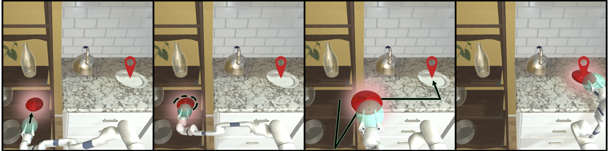

# ManipulaTHOR: A Framework for Visual Object Manipulation
#### Kiana Ehsani, Winson Han, Alvaro Herrasti, Eli VanderBilt, Luca Weihs, Eric Kolve, Aniruddha Kembhavi, Roozbeh Mottaghi
#### Oral Presentation at CVPR 2021

We present <b>ManipulaTHOR</b>, an extension to the AI2-THOR framework that adds arms to its agents. Our framework offers <b>powerful physics engine</b>, variety of <b>realistic indoor scenes</b>, large asset library of open source <b>manipulable objects</b> as well as articulated receptacles. ManipulaTHOR allows agents to interact with objects at a <b>lower level via their arm manipulators</b>, and thus opens up a whole new direction for Embodied AI research. The sensors that are available for use are RGB image, depth frame, GPS, agent’s location, and arm configuration.

Using ManipulaTHOR, we address the problem of visual object manipulation, <b>ArmPointNav</b>, where the goal is to move an object between two locations in a scene. Operating in visually rich and complex environments, generalizing to unseen environments and objects, avoiding collisions with objects and structures in the scene, and visual planning to reach the destination are among the major challenges of this task.

This code base is based on <a href=https://allenact.org/>AllenAct</a> framework and the majority of the core training algorithms and pipelines are borrowed from <a href=https://github.com/allenai/allenact>AllenAct code base</a>. 

### Contents
<div class="toc">
<ul>
<li><a href="#-installation">💻 Installation</a></li>
<li><a href="#-armpointnav-task-description">📝 ArmPointNav Task Description</a></li>
<li><a href="#-dataset">📊 Dataset</a></li>
<li><a href="#-sensory-observations">🖼️ Sensory Observations</a></li>
<li><a href="#-allowed-actions">🏃 Allowed Actions</a></li>
<li><a href="#-defining-a-new-task">✨Defining a New Task</a></li>
<li><a href="#-training-an-agent">🏋 Training an Agent</a></li>
<li><a href="#-evaluating-a-pre-trained-agent">💪 Evaluating a Pre-Trained Agent</a></li>
</ul>
</div>

## 💻 Installation
 
To begin, clone this repository locally
```bash
git clone https://github.com/ehsanik/manipulathor.git
```
<details>
<summary><b>See here for a summary of the most important files/directories in this repository</b> </summary> 
<p>

Here's a quick summary of the most important files/directories in this repository:
* `utils/*.py` - Helper functions and classes including the visualization helpers.
* `projects/armpointnav_baselines`
    - `experiments/`
        + `ithor/armpointnav_*.py` - Different baselines introduced in the paper. Each files in this folder corresponds to a row of a table in the paper.
        + `*.py` - The base configuration files which define experiment setup and hyperparameters for training.
    - `models/*.py` - A collection of Actor-Critic baseline models.  
* `plugins/ithor_arm_plugin/` - A collection of Environments, Task Samplers and Task Definitions
    - `ithor_arm_environment.py` - The definition of the `ManipulaTHOREnvironment` that wraps the AI2THOR-based framework introduced in this work and enables an easy-to-use API.  
    - `itho_arm_constants.py` - Constants used to define the task and parameters of the environment. These include the step size 
      taken by the agent, the unique id of the the THOR build we use, etc.
    - `ithor_arm_sensors.py` - Sensors which provide observations to our agents during training. E.g. the
      `RGBSensor` obtains RGB images from the environment and returns them for use by the agent. 
    - `ithor_arm_tasks.py` - Definition of the `ArmPointNav` task, the reward definition and the function for calculating the goal achievement. 
    - `ithor_arm_task_samplers.py` - Definition of the `ArmPointNavTaskSampler` samplers. Initializing the sampler, reading the json files from the dataset and randomly choosing a task is defined in this file. 
    - `ithor_arm_viz.py` - Utility functions for visualization and logging the outputs of the models.

</p>
</details>

You can then install requirements by running
```bash
pip install -r requirements.txt
```


**Python 3.6+ 🐍.** Each of the actions supports `typing` within <span class="chillMono">Python</span>.

**AI2-THOR <43f62a0> 🧞.** To ensure reproducible results, please install this version of the AI2THOR.

## 📝 ArmPointNav Task Description



ArmPointNav is the goal of addressing the problem of visual object manipulation, where the task is to move an object between two locations in a scene. Operating in visually rich and complex environments, generalizing to unseen environments and objects, avoiding collisions with objects and structures in the scene, and visual planning to reach the destination are among the major challenges of this task. The example illustrates a sequence of actions taken a by a virtual robot within the ManipulaTHOR environment for picking up a vase from the shelf and stack it on a plate on the countertop.
   
## 📊 Dataset

To study the task of ArmPointNav, we present the ArmPointNav Dataset (APND). This consists of 30 kitchen scenes in AI2-THOR that include more than 150 object categories (69 interactable object categories) with a variety of shapes, sizes and textures. We use 12 pickupable categories as our target objects. We use 20 scenes in the training set and the remaining is evenly split into Val and Test. We train with 6 object categories and use the remaining to test our model in a Novel-Obj setting. For more information on dataset, and how to download it refer to <a href="datasets/README.md">Dataset Details</a>.

## 🖼️ Sensory Observations

The types of sensors provided for this paper include:

1. **RGB images** - having shape `224x224x3` and an FOV of 90 degrees.  
2. **Depth maps** - having shape `224x224` and an FOV of 90 degrees.
3. **Perfect egomotion** - We allow for agents to know precisely what the object location is relative to the agent's arm as well as to its goal location.


## 🏃 Allowed Actions

A total of 13 actions are available to our agents, these include:

1. **Moving the agent**

* `MoveAhead` - Results in the agent moving ahead by 0.25m if doing so would not result in the agent colliding with something.

* `Rotate [Right/Left]` - Results in the agent's body rotating 45 degrees by the desired direction.

2. **Moving the arm**

* `Moving the wrist along axis [x, y, z]` - Results in the arm moving along an axis (<span>&#177;</span>x,<span>&#177;</span>y, <span>&#177;</span>z) by 0.05m.

* `Moving the height of the arm base [Up/Down]` - Results in the base of the arm moving along y axis by 0.05m.

3. **Abstract Grasp**

* Picks up a target object. Only succeeds if the object is inside the arm grasper.
  
4. **Done Action**

* This action finishes an episode. The agent must issue a `Done` action when it reaches the goal otherwise the episode considers as a failure.

## ✨ Defining a New Task

### The ManipulaTHOR Environment class

The `rearrange.environment.RearrangeTHOREnvironment` class provides a wrapper around the AI2-THOR environment
and is designed to 
1. Make it easy to set up a AI2-THOR scene in a particular state ready for rearrangement.
1. Provides utilities to make it easy to evaluate (see e.g. the `poses` and  `compare_poses` methods)
  how close the current state of the environment is to the goal state.
1. Provide an API with which the agent may interact with the environment.

### The ArmPointNav Task Sampler class

You'll notice that the above `RearrangeTHOREnvironment` is not explicitly instantiated by the `example.py`
script and, instead, we create `rearrange.tasks.RearrangeTaskSampler` objects using the
`TwoPhaseRGBBaseExperimentConfig.make_sampler_fn` and `OnePhaseRGBBaseExperimentConfig.make_sampler_fn`.
This is because the `RearrangeTHOREnvironment` is very flexible and doesn't know anything about
training/validation/test datasets, the types of actions we want our agent to be restricted to use,
or precisely which types of sensor observations we want to give our agents (e.g. RGB images, depth maps, etc).
All of these extra details are managed by the `RearrangeTaskSampler` which iteratively creates new
tasks for our agent to complete when calling the `next_task` method. During training, these new tasks can be sampled
indefinitely while, during validation or testing, the tasks will only be sampled until the validation/test datasets
are exhausted. This sampling is best understood by example so please go over the `example.py` file.

### The ArmPointNav Task classes

As described above, the `RearrangeTaskSampler` samples tasks for our agent to complete, these tasks correspond
to instantiations of the `rearrange.tasks.WalkthroughTask` and `rearrange.tasks.UnshuffleTask` classes. For the 2-phase
challenge track, the `RearrangeTaskSampler` will first sample a new `WalkthroughTask` after which it will sample a 
corresponding `UnshuffleTask` where the agent must return the objects to their poses at the start of the
`WalkthroughTask`. 

## 🏋 Training An Agent

for training add experiments in experiments/ithor
what to define
the list of current experiment options

## 💪 Evaluating A Pre-Trained Agent 

To reproduce the numbers in the paper...
how to download the models in pretrained_model_ckpts....
list of scripts to run in a file in pretrained
